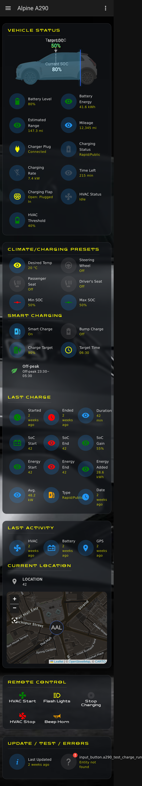
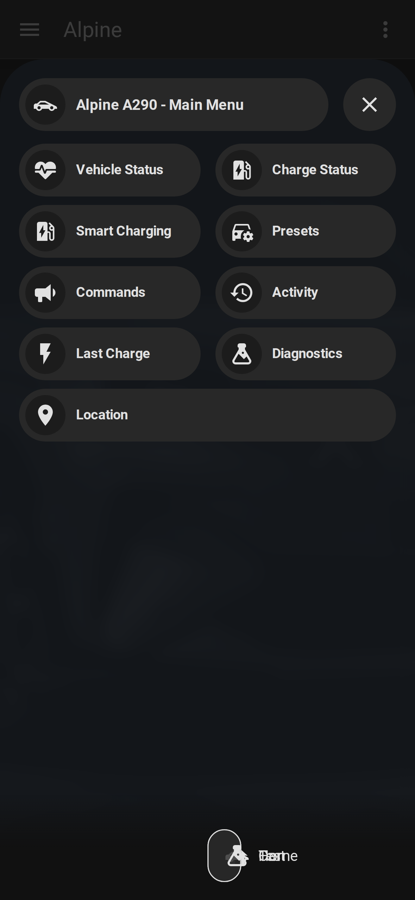
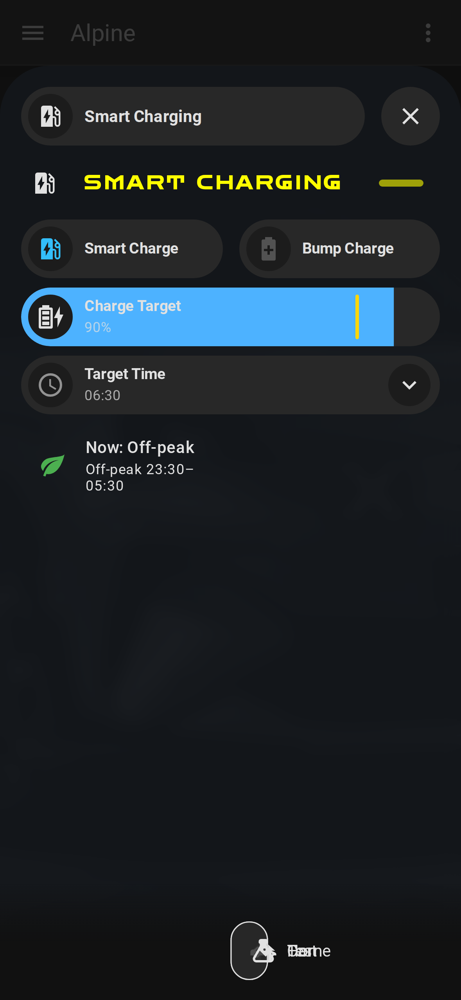

# Alpine A290 — Home Assistant app + dashboards

This app logs in to your car's **My Alpine** account, reads its data (battery, charging,
location, climate) every few minutes, and shows it in Home Assistant — you enter your login
once on the Configuration page, no files to edit.

| Standard dashboard | Bubble dashboard | Smart Charging |
| --- | --- | --- |
|  |  |  |

Under the hood it polls the [Renault/Kamereon API](https://github.com/hacf-fr/renault-api)
and publishes `sensor.alpine_a290_*` entities over **MQTT auto-discovery**.

The **dashboards now ship inside the app** (previously a separate `a290-dashboard-view`
repo — since merged in and archived): enable `deploy_dashboard` and the app installs a
ready-made dashboard for you. Controls (lights, horn, climate, refresh location) are sent
**natively** by the app — **you do not need Home Assistant's `renault` integration**. (Remote
charge-start is forbidden by Renault on the A290, so no Start Charging button is offered —
that's a platform limit, not a missing feature.)

## What's here

- **The app:** [`alpine_a290/`](alpine_a290/) — the MQTT data layer + control buttons.
  See [`alpine_a290/DOCS.md`](alpine_a290/DOCS.md) for the full entity/option list.
- **The dashboards:** [`alpine_a290/dashboards/`](alpine_a290/dashboards/) — a **standard**
  dashboard (`front-end.txt`) and a **Bubble Card** dashboard (`front-end-bubble.txt`),
  both fed by the app. The app can install either — or **both** — for you
  (`deploy_dashboard: standard|bubble|both`), or you can copy them in manually. Assets
  (A290 renders, map markers, Zen Dots font) live under `alpine_a290/dashboards/`. Both are
  built for phones and [**verified on the top mobile devices**](docs/dashboards-on-mobile.md)
  by CI.

## Requirements

Install these **before** the dashboards will render correctly.

### Apps (Settings → Apps)

| Dependency | Why | Required? |
| --- | --- | --- |
| **Mosquitto broker** | The MQTT broker the app publishes to (auto-discovered). | ✅ Required |
| **Alpine A290** (this repo) | The data layer + control buttons. | ✅ Required |

### Frontend cards (via [HACS](https://hacs.xyz) → Frontend)

The dashboards are built from custom Lovelace cards. Install **HACS** first, then:

| Card (HACS name) | Used by | Required? |
| --- | --- | --- |
| **card-mod** (`thomasloven/lovelace-card-mod`) | styling/fonts on **both** dashboards | ✅ Required (both) |
| **Mushroom** (`piitaya/lovelace-mushroom`) | most tiles on the **standard** dashboard | ✅ Required (both) |
| **Button Card** (`custom-cards/button-card`) | tiles on **both** dashboards | ✅ Required (both) |
| **Browser Mod** (`nielsfaber/browser_mod`) | the tap-to-open pop-ups on the **standard** dashboard | ✅ Standard (pop-ups) |
| **Bubble Card** (`Clooos/Bubble-Card`) | the **Bubble** dashboard only | ◻️ Bubble only |

The car's location uses Home Assistant's **built-in `map` card** — no map plugin or API
key needed.

### Optional (not required to run)

- **Test-mode preview** — the charge-simulation panels. A small HA helper/template package
  (`alpine_a290/dashboards/Packages/`, `Templates/`, `Helpers/`); without it those tiles
  read *unavailable*.
- **Pretty location** — `sensor.alpine_pretty_location` ("Driveway / Home / town"), a
  template sensor (`alpine_a290/dashboards/Templates/`) with an optional
  [`places`](https://github.com/custom-components/places) integration. Without it the
  location card shows the raw tracker.

## Install

1. **Install the dependencies first** — so a deployed dashboard renders immediately instead
   of as "custom element doesn't exist":
   - **Mosquitto broker** (Settings → Apps → App Store) — the app auto-discovers it.
   - **[HACS](https://hacs.xyz)** and the frontend cards from [Requirements](#requirements)
     above (card-mod, Mushroom, Button Card, Browser Mod, plus Bubble Card for the bubble
     dashboard).
2. **Add the app repo + install it:** Settings → Apps → App Store → ⋮ →
   **Repositories**, add `https://github.com/MatthewHobbs/a290-ha-addon`, then install the
   **Alpine A290** app.
3. **Configure + start:** on the **Configuration** tab set your My Alpine
   `username`/`password`, `vin`, `locale`, `battery_capacity_kwh` (and `account_id` only if
   you have multiple accounts — it's auto-discovered otherwise), then **Start**. The
   `sensor.alpine_a290_*` / `binary_sensor.alpine_a290_*` entities and `button.alpine_a290_*`
   controls appear under an **Alpine A290** device within a minute.
4. **Get a dashboard:** set `deploy_dashboard` to `standard`, `bubble`, or `both` and
   restart the app (it installs the dashboard + assets via CDN, nothing to copy), **or**
   copy `alpine_a290/dashboards/front-end*.txt` into a new dashboard's raw config manually.
   With `both`, the standard dashboard lands at your `dashboard_url_path` and the bubble one
   gets a `-bubble` suffix (e.g. `alpine-a290` and `alpine-a290-bubble`).

## What it provides

- **Sensors:** battery level/range/temperature, charging power/remaining/flap/plug/status,
  available energy, outside temperature, HVAC (climate) status/threshold, preconditioning,
  charge target/min State of Charge (SoC — how full the battery is, as a %), mileage,
  last-charge stats, GPS/HVAC last-activity, and health (`api_auth_failure`, `data_stale`,
  `plug_state_suspect`). Tyre pressure and charge mode are forbidden by Renault on the A290
  and are not published.
- **Location:** `device_tracker.alpine_a290_location` — on by default (coarsened per
  `gps_precision`); set `publish_location: false` to fetch none and clear any
  previously-retained GPS from the broker, for a zero location footprint.
- **Native controls (no Home Assistant `renault` integration):**
  `button.alpine_a290_sound_horn`, `…_flash_lights`, `…_start_climate`, `…_stop_climate`,
  `…_refresh_location` — each gated on what the platform supports (charge-start is
  forbidden on the A290, so it isn't shipped).
- **Writable charge limits:** `number.alpine_a290_minimum_soc` (15–45 %) and
  `number.alpine_a290_charge_target_soc` (55–100 %) — sliders that set the car's charge limits
  via `set_battery_soc` (`soc-levels`). These cover the one capability Home Assistant's `renault` integration had over the app, so it's no longer needed.
- **Debug:** set `debug_dump: true` to log every readable API endpoint (secrets redacted)
  to the app Log — the safe way to diagnose the API (unlike `log_level: debug`, which
  the library would use to print access tokens).

## Alpine A290 API support

What the Alpine A290 (model `A5E1AE`) exposes through the Renault/Kamereon API. Renault
forbids some endpoints on this model — those features aren't shipped (a platform limit, not
a bug); the app probes `supports_endpoint()` at startup and only publishes what's
available.

| Feature | Endpoint | A290 |
| --- | --- | --- |
| Battery / charge / plug status | `battery-status` | ✅ |
| Mileage | `cockpit` | ✅ |
| HVAC + outside temperature | `hvac-status` | ✅ |
| Charge target / min SoC (read **and** set) | `soc-levels` | ✅ |
| Preconditioning + heated seats | `ev/settings` | ✅ |
| GPS location | `location` | ✅ |
| Sound horn | `actions/horn-start` | ✅ |
| Flash lights | `actions/lights-start` | ✅ |
| Start / stop climate | `actions/hvac-start` · `actions/hvac-stop` | ✅ |
| Refresh location | `actions/refresh-location` | ⚠️ best-effort (may 403) |
| Tyre pressure (TPMS) | `pressure` | ❌ forbidden |
| Charge mode | `charge-mode` | ❌ forbidden |
| Start / stop charging | `actions/charge-start` · `actions/charge-stop` | ❌ forbidden |

✅ supported · ⚠️ library default, untested (may return forbidden) · ❌ Renault forbids it on the A290

> Set `debug_dump: true` to log the decoded response of every readable endpoint (secrets
> redacted) — useful if Renault changes what the platform exposes.

## Credits

The dashboards originally started from
[**renault-5-dashboard-view**](https://github.com/Topolino65/renault-5-dashboard-view) by
[**Topolino65**](https://github.com/Topolino65) — full credit for the original dashboards,
assets and design. Adapted for the Alpine A290 and maintained independently; no changes are
submitted upstream. MIT licensed.
